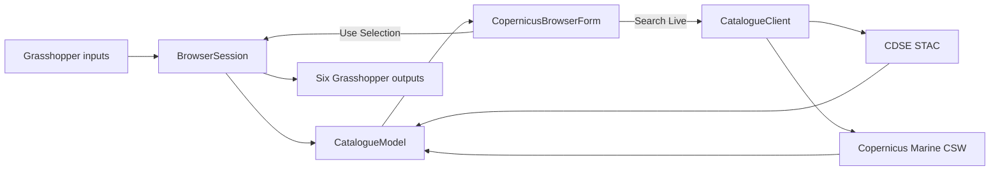
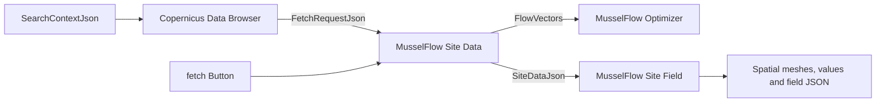

# Copernicus Data Browser — canonical architecture

This document is the handoff for the clean Rhino 8 / Grasshopper browser. The
canonical implementation is `copernicus_data_browser_gh_sdk.py`. It is a
standalone SDK-mode Python component: no sidecar, package install, desktop
helper, or operating-system-specific path is required.

## Public Grasshopper contract

Inputs, in order:

1. `openBrowser` — item, Boolean
2. `data` — item, broker Data JSON, optional
3. `collections` — list, text, optional
4. `items` — list, text, optional
5. `assets` — list, text, optional
6. `fetchLog` — list, text, optional
7. `windowTitle` — item, text, optional
8. `SearchContextJson` — item, catalogue-search intent JSON, optional

Outputs, in order:

1. `SelectedType`
2. `SelectedId`
3. `SelectedUrl`
4. `FetchRequestJson`
5. `IsOpen`
6. `Report`

Do not reorder these ports. `BeforeRunScript` owns names, list access, optional
flags, descriptions, and hover tooltips. `RunScript` owns values only.

## Data flow

## Relationship to the MusselFlow data nodes

The browser is a catalogue/discovery component. `FetchRequestJson` merges the
accepted product metadata with the validated Search Context. It deliberately
contains no invented environmental values: the downstream Site Data component
performs the real request using the coordinate, time and depths in that JSON.

The operational MusselFlow chain is:

For a general, non-MusselFlow request, connect `SelectedId` to the Universal
Data Broker's `collection` input and configure a compatible STAC or WMTS mode.
The browser request must never be relabelled as `SiteData`: only the Site Data
fetcher produces that canonical sampled-data contract.

## Search-context adapter

`copernicus_search_context_gh_sdk.py` is the one-wire adapter for parametric
Grasshopper workflows. It validates and packages WGS84 latitude/longitude,
time interval, depths, desired variables, an optional product/layer preference,
desired pixel size and extra keywords under schema
`copernicus.search_context.1.0`.

Connect `Search Context.SearchContextJson` to `Data Browser.SearchContextJson`. The browser detects
the schema, keeps region constraints mandatory, treats multiple variables as
inclusive product families, and uses the primary variable as the default live
catalogue query. Manual text in the browser further narrows the context result.

The dedicated input makes the connection visible while being appended after all
seven original browser inputs, so their order and existing wires remain stable.
It also keeps catalogue intent separate from broker `Data` and measured
`SiteData`.

After pressing `Use Selection`, connect `Data Browser.FetchRequestJson` to the
final `MusselFlow Site Data.FetchRequestJson` input. The request supplies site,
time and depths; the existing `fetch` Button starts the actual sampling. Manual
Site Data inputs remain available as fallbacks when the request omits a field.

## Ownership boundaries

### 1. Pure data helpers

Normalize Grasshopper values, parse JSON, merge and deduplicate collections,
find selections, and create the six-product offline register. They contain no
Eto or Rhino calls and are therefore directly testable.

### 2. `CatalogueModel`

Owns the current document, visible source rows, fetch log, local filtering, and
selection resolution. Loading new collections must preserve existing STAC
features/items. A failed network search must never erase current data.

### 3. `CatalogueClient`

Owns all network access and parsing. Requests are HTTPS-only, restricted to the
official CDSE STAC and Copernicus Marine CSW hosts, time-bounded, response-size
bounded, and executed away from Rhino's UI thread. CDSE and Marine searches run
concurrently; one valid source is enough for a successful result.

### 4. `CopernicusBrowserForm`

Owns Eto controls and presentation only. It renders model state, starts a
background search, marshals completion back to the UI thread, and forwards an
accepted selection to the session. A monotonically increasing search token
prevents a stale worker from changing a closed or reset window.

### 5. `BrowserSession`

Owns one Grasshopper component's persistent state in `scriptcontext.sticky`:
its modeless form, accepted selection, input signature, search status, and
report. A build change retires an older form safely. The session schedules a
new Grasshopper solution only when outputs actually need refreshing.

## Required invariants

- The six starter products appear before any network request.
- Local search works offline for Baltic, North Sea, currents, oxygen,
  chlorophyll, and phytoplankton.
- Live search never blocks Rhino's UI thread.
- DNS/server failure preserves starter, cached, and broker data.
- Old asynchronous results cannot overwrite a newer search or closed window.
- A successful `Form.Show()` remains successful even if `BringToFront()` is
  unsupported by the platform.
- A failed window construction/show disposes its partial form.
- Accepted output state survives ordinary Grasshopper recomputation.
- The component remains standalone and cross-platform through RhinoCommon,
  Grasshopper, Eto, and Python standard-library imports only.

## Regression checks

`test_copernicus_data_browser.py` protects the typed SDK signature, six-output
contract, starter catalogue, local search vocabulary, collection
deduplication, feature preservation, and Marine CSW parsing. Run it together
with the project suite before changing this component.

The one check that cannot run outside Rhino is the native window itself. In
Rhino 8, paste the canonical file into a Python 3 component, convert it to SDK
mode, connect a Button to `openBrowser`, and confirm: the six starters appear,
local filtering is immediate, Search Live keeps Rhino responsive, and Use
Selection updates the first four outputs.

## Future plug-in migration

When this becomes a compiled Rhino plug-in, retain these boundaries. Move the
model and client into ordinary cross-platform library classes, convert the Eto
form nearly unchanged, and replace `scriptcontext.sticky` with plug-in-managed
session state. The Grasshopper component should remain a thin adapter around
the same seven-input/six-output contract.
