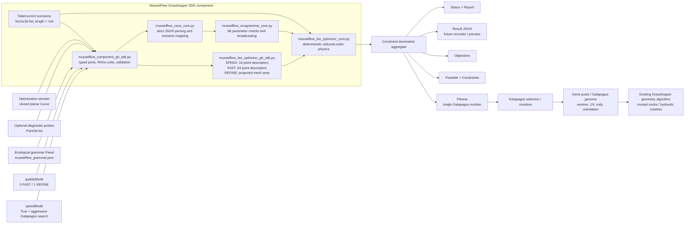

# MusselFlow fast-fitness pipeline

## Runtime path

1. Grasshopper generates one candidate geometry set from the current genome.
2. The SDK validates domain, geometry, probes, flow vectors, and Rhino units.
3. The unchanged ecological grammar is parsed and compiled once, then cached.
4. `speedMode = True` uses at most 16 geometry points and 64 domain samples
   for broad Galapagos exploration while retaining all ecological equations.
   With speed mode off, `qualityMode = 0` reduces Rhino geometry to six values:
   `x, y, major, minor, yaw, height`. `qualityMode = 1` retains that stable
   envelope and additionally measures direction-specific projected frontal
   area from a coarse analysis mesh.
5. The NumPy core evaluates wake, food, filtration, oxygen, sediment, objectives,
   and hard constraints.
6. A feasible design receives fitness in `[0.25, 1]`; an infeasible design
   remains below `0.25`, so ecological reward cannot overpower safety limits.
7. Galapagos changes the upstream genes and repeats the pipeline.

The detailed `Result` output is deliberately separate from viewport
visualization. It can later feed the wild-camera recorder and time-lapse
preview without placing animation work inside every Galapagos evaluation.
