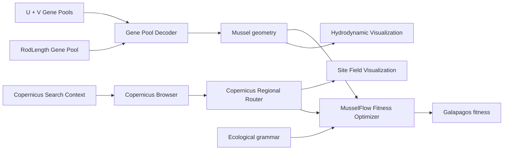

# Oyster / Mussel Farm Plugin

A Rhino 8 / Grasshopper workflow for generating mussel-farm geometries, loading Copernicus site conditions, visualizing water movement and comparing farm arrangements.

## Workflow

## Folders

- **Miesmuschel** — the active MusselFlow generator, optimizer, visualization, site-data components and their required internal modules.
- **Copernicus Browser GH** — the two components used to define a search and browse Copernicus products.
- **archive** — previous experiments, unused components, tests and development notes retained for reference.

The active Grasshopper scripts are SDK-mode Python 3 components for Rhino 8.
